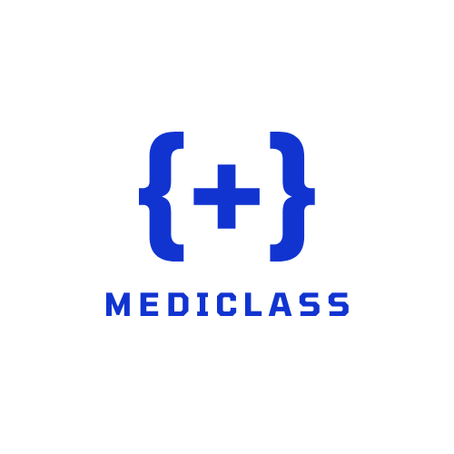

# MediClass

Sistema de Prontuário Eletrônico e Apoio à Decisão Clínica em Python.

## Visão Geral

MediClass é uma aplicação de linha de comando que permite gerenciar prontuários eletrônicos de pacientes, realizar triagens de enfermagem, apoiar decisões clínicas com sugestões de diagnóstico, gerar receituários e declarações de comparecimento, além de registrar exames laboratoriais ou de imagem. Foi desenvolvido como um exercício prático dos conceitos de Programação Orientada a Objetos (POO): encapsulamento, herança, abstração e polimorfismo
> “Este artigo apresenta o MediClass, um sistema de prontuário eletrônico e apoio à decisão clínica implementado em Python, que aplica os pilares da Programação Orientada a Objetos […]”

## Funcionalidades Principais

- **Autenticação de profissionais** (Médicos, Enfermeiros e Técnicos)  
- **Registro de entrada de paciente** via CPF, com persistência em JSON  
- **Triagem de enfermagem**: coleta de sinais vitais e anamnese segmentada por tipo de sintoma  
- **Consulta médica**: sugestões de diagnóstico baseadas em árvores de decisão clínica  
- **Geração de documentos**: receituários e declarações de comparecimento em formato `.txt`  
- **Registro de exames** por técnicos, armazenando laudos no histórico do paciente  
- **Exportação de prontuário completo** em arquivo `.txt`  

## Arquitetura e Módulos

O projeto está organizado em seis módulos Python:

| Arquivo            | Responsabilidade                                                        |
|--------------------|-------------------------------------------------------------------------|
| `main.py`          | Ponto de entrada: carrega dados, inicializa `SistemaMediclass`          |
| `sistema.py`       | Orquestra o fluxo CLI: login, menu principal e dispatch de operações    |
| `profissionais.py` | Define `Profissional` (abstrato) e subclasses `Medico`, `Enfermeiro`, `Tecnico` |
| `paciente.py`      | Modela classe `Paciente`: dados cadastrais, histórico e persistência    |
| `anamnese.py`      | Enumera `TipoSintoma` e classe `Anamnese` para coleta de sinais vitais  |
| `diagnostico.py`   | Lógica de decisão clínica e classe `Diagnostico` para hipóteses de diagnóstico |

### Diagrama UML (resumo)

- **Profissional** (abstract)  
  - + `autenticar()`  
  - ↳ **Enfermeiro**: `triagem()`  
  - ↳ **Medico**: `sugerir_diagnosticos()`, `gerar_receituario()`, `gerar_declaracao_comparecimento()`  
  - ↳ **Tecnico**: `adicionar_exame_sistema()`  

- **Paciente**  
  - `registrar_entrada()`, `atualizar_historico()`, `consultar_historico()`, `adicionar_exame()`  

- **Anamnese**  
  - Sinais vitais, tipo de sintoma e timestamp → serialização via `to_dict()`  

- **Diagnostico**  
  - Categoria, descrição e exames sugeridos → formatação em `__str__()`  

## Pré-requisitos

- Python 3.8 ou superior  
- Bibliotecas [stdlib]: `json`, `hashlib`, `enum`, `datetime`, `os`

## Instalação

1. Clone o repositório:  
   ```bash
   git clone https://github.com/matheusmarcondes1/mediclass.git
   cd mediclass

## Documentação


